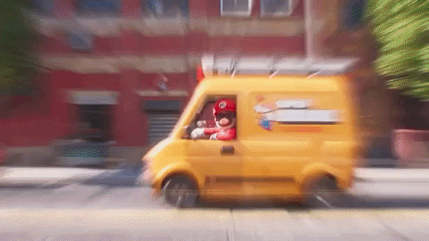
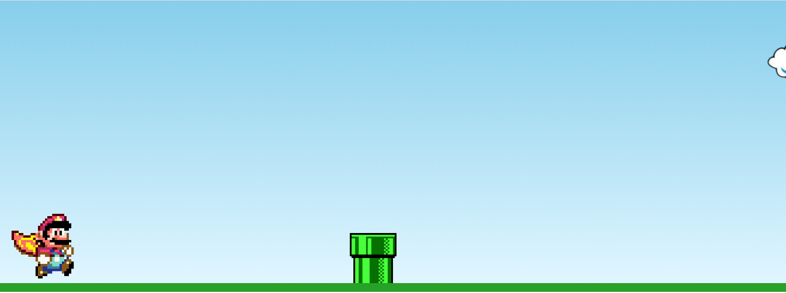

### 💻 Sobre o Projeto:

Este é um projeto que fiz com o objetivo de evoluir minha habilidades em java script. O tema escolhido foi "Super mario", e foi criado um jogo simples utilizando apenas HTML5 e CSS3 e Java Script. 
 
### 🛠 Tecnologias utilizadas:

    <ul>
        <li>HTML</li>
        <li>CSS</li>
        <li>Java Script</li>
    </ul>

### 🎨 Pré-visualização :

